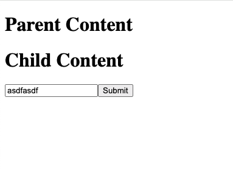
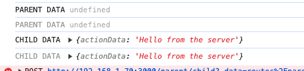

# Welcome to Remix!

- [Remix Docs](https://remix.run/docs)

## Development

From your terminal:

```sh
npm run dev
```

This starts your app in development mode, rebuilding assets on file changes.

## Test case
1. Navigate to localhost:3000/parent/child
2. Submit the form with some data
3. Open the console to observer the logs outputting from useActionData


### UI:


### Logs:


